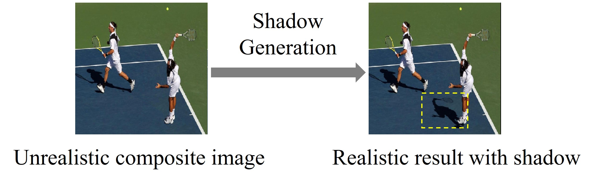

# Awesome Object Shadow Generation 

A curated list of resources including papers, datasets, and relevant links pertaining to object shadow generation. **Shadow generation aims to generate plausible shadow for the inserted foreground object in a composite image.** For more complete resources on general 
image composition ([object insertion](https://github.com/bcmi/Awesome-Object-Insertion)), please refer to [Awesome-Image-Composition](https://github.com/bcmi/Awesome-Object-Insertion).

  
  

## Contributing

Contributions are welcome.  If you wish to contribute, feel free to send a pull request. If you have suggestions for new sections to be included, please raise an issue and discuss before sending a pull request.

## Table of Contents
+ [Survey](#Survey)
+ [Online Demo](#Online-demo)
+ [Papers](#Papers)
+ [Datasets](#Datasets)
+ [Other Resources](#Other-resources)

## Survey

A brief review on object shadow generation is included in the following survey on image composition:

Li Niu, Wenyan Cong, Liu Liu, Yan Hong, Bo Zhang, Jing Liang, Liqing Zhang: "*Making Images Real Again: A Comprehensive Survey on Deep Image Composition.*" arXiv preprint arXiv:2106.14490 (2021). [[arXiv]](https://arxiv.org/pdf/2106.14490.pdf) [[slides]](https://www.ustcnewly.com/download/Image_composition_tutorial.pdf)

## Online Demo

Try this [online demo](https://bcmi.sjtu.edu.cn/home/niuli/demo_image_composition/) for shadow generation and have fun! 
 
## Papers

#### Supervised deep learning methods
+ Haonan Zhao, Qingyang Liu, Xinhao Tao, Li Niu, Guangtao Zhai: "*Shadow Generation Using Diffusion Model with Geometry Prior.*" CVPR (2025) [[code]](https://github.com/bcmi/GPSDiffusion-Object-Shadow-Generation)
+ Ziqi Yu, Jing Zhou, Zhongyun Bao, Gang Fu, Weilei He, Chao Liang, Chunxia Xiao: "*CFDiffusion: Controllable Foreground Relighting in Image Compositing via Diffusion Model.*" ACM MM (2024) [[pdf]](https://dl.acm.org/doi/pdf/10.1145/3664647.3681283)
+ Jing Zhou, Ziqi Yu, Zhongyun Bao, Gang Fu, Weilei He, Chao Liang, Chunxia Xiao: "*Foreground Harmonization and Shadow Generation for Composite Image.*" ACM MM (2024) [[pdf]](https://dl.acm.org/doi/pdf/10.1145/3664647.3681283)
+ Daniel Winter, Matan Cohen, Shlomi Fruchter, Yael Pritch, Alex Rav-Acha, Yedid Hoshen: "*ObjectDrop: Bootstrapping Counterfactuals for Photorealistic Object Removal and Insertion.*"  ECCV (2024) [[pdf]](https://www.ecva.net/papers/eccv_2024/papers_ECCV/papers/09857.pdf)
+ Gemma Canet Tarrés, Zhe Lin, Zhifei Zhang, Jianming Zhang, Yizhi Song, Dan Ruta, Andrew Gilbert, John Collomosse, Soo Ye Kim："*Thinking Outside the BBox: Unconstrained Generative Object Compositing.*" ECCV (2024) [[pdf]](https://www.ecva.net/papers/eccv_2024/papers_ECCV/papers/07965.pdf)
+ Qingyang Liu, Junqi You, Jianting Wang, Xinhao Tao, Bo Zhang, Li Niu: "*Shadow Generation for Composite Image Using Diffusion Model.*" CVPR (2024) [[arXiv]](https://arxiv.org/pdf/2403.15234.pdf) [[dataset&code]](https://github.com/bcmi/Object-Shadow-Generation-Dataset-DESOBAv2) 
+ Xinhao Tao, Junyan Cao, Yan Hong, Li Niu: "*Shadow Generation with Decomposed Mask Prediction and Attentive Shadow Filling.*" AAAI (2024) [[arXiv]](https://arxiv.org/pdf/2306.17358.pdf) [[dataset]](https://github.com/bcmi/Rendered-Shadow-Generation-Dataset-RdSOBA)
+ Lucas Valença, Jinsong Zhang, Michaël Gharbi, Yannick Hold-Geoffroy, Jean-François Lalonde: "*Shadow Harmonization for Realistic Compositing.*" SIGGRAPH Asia (2023) [[paper]](https://dl.acm.org/doi/pdf/10.1145/3610548.3618227)
+ Quanling Meng, Shengping Zhang, Zonglin Li, Chenyang Wang, Weigang Zhang, Qingming Huang: "*Automatic Shadow Generation via Exposure Fusion.*" T-MM (2023) [[paper]](https://ieeexplore.ieee.org/stamp/stamp.jsp?tp=&arnumber=10043015)
+ Yichen Sheng, Jianming Zhang, Julien Philip, Yannick Hold-Geoffroy, Xin Sun, He Zhang, Lu Ling, Bedrich Benes: "*PixHt-Lab: Pixel Height Based Light Effect Generation for Image Compositing.*" CVPR (2023) [[paper]](https://openaccess.thecvf.com/content/CVPR2023/papers/Sheng_PixHt-Lab_Pixel_Height_Based_Light_Effect_Generation_for_Image_Compositing_CVPR_2023_paper.pdf) [[code]](https://github.com/ShengCN/PixHtLab-Src)
+ Tianyanshi Liu, Yuhang Li, Youdong Ding: "*Shadow Generation for Composite Image with Multi-level Feature Fusion.*"  EITCE (2022) [[pdf]](https://dl.acm.org/doi/pdf/10.1145/3573428.3573675?casa_token=q3Ca0DSbzJEAAAAA:jxKz2vZb7PEtn4IMwmxdD3o9-iq74h3XHqkT7Y9gEgMcWK2j9XkjQkF2ho_5cW2B25MUlzZ8qwcGyQ)
+ Yan Hong, Li Niu, Jianfu Zhang: "*Shadow Generation for Composite Image in Real-world Scenes.*" AAAI (2022) [[arXiv]](https://arxiv.org/pdf/2104.10338v1.pdf) [[dataset&code]](https://github.com/bcmi/Object-Shadow-Generation-Dataset-DESOBA)
+ Yichen Sheng, Yifan Liu, Jianming Zhang, Wei Yin, Oztireli Cengiz, He Zhang, Lin Zhe, Shechtman Eli, Bedrich Benes: "*Controllable Shadow Generation Using Pixel Height Maps.*" ECCV (2022) [[arXiv]](https://arxiv.org/pdf/2207.05385.pdf) [[Project]](https://shengcn.github.io/SSG/)
+ Yichen Sheng, Jianming Zhang, Bedrich Benes: "*SSN: Soft shadow network for image compositing.*" CVPR (2021) oral [[pdf]](https://openaccess.thecvf.com/content/CVPR2021/papers/Sheng_SSN_Soft_Shadow_Network_for_Image_Compositing_CVPR_2021_paper.pdf)  [[code]](https://github.com/ShengCN/SSN_SoftShadowNet) [[Project]](https://shengcn.github.io/SSN/)
+ Daquan Liu, Chengjiang  Long, Hongpan Zhang, Hanning Yu, Xinzhi  Dong, Chunxia Xiao: "*ARshadowGAN: Shadow generative adversarial network for augmented reality in single light scenes.*" CVPR (2020) [[pdf]](https://openaccess.thecvf.com/content_CVPR_2020/papers/Liu_ARShadowGAN_Shadow_Generative_Adversarial_Network_for_Augmented_Reality_in_Single_CVPR_2020_paper.pdf) [[code]](https://github.com/ldq9526/ARShadowGAN)
+ Shuyang Zhang, Runze Liang, Miao Wang: "*ShadowGAN: Shadow synthesis for virtual objects with conditional adversarial networks.*" Computational Visual Media (2019) [[pdf]](https://link.springer.com/content/pdf/10.1007/s41095-019-0136-1.pdf)

#### Unsupervised deep learning methods

+ Fangneng Zhan, Shijian Lu, Changgong Zhang, Feiying Ma, Xuansong Xie: "*Adversarial Image Composition with Auxiliary Illumination.*" ACCV (2020) [[pdf]](https://openaccess.thecvf.com/content/ACCV2020/papers/Zhan_Adversarial_Image_Composition_with_Auxiliary_Illumination_ACCV_2020_paper.pdf)

#### Traditional methods

+ Bin Liao, Yao Zhu, Chao Liang, Fei Luo, Chunxia Xiao: "*Illumination animating and editing in a single picture using scene structure estimation.*" Computers & Graphics (2019) [[pdf]](https://www.sciencedirect.com/science/article/abs/pii/S0097849319300627)

+ Bin Liu, Kun Xu, Ralph R. Martin: "*Static scene illumination estimation from videos with applications.*" Journal of Computer Science and Technology (2017) [[pdf]](https://link.springer.com/content/pdf/10.1007/s11390-017-1734-y.pdf)

+ Kevin Karsch, Kalyan Sunkavalli, Sunil Hadap, Nathan Carr, Hailin Jin, Rafael Fonte, Michael Sittig, David Forsyth: "*Automatic scene inference for 3d object compositing.*" ACM Transactions on Graphics (2014) [[arXiv]](https://arxiv.org/pdf/1912.12297.pdf)

+ Kevin Karsch, Varsha Hedau, David Forsyth, Derek Hoiem: "*Rendering synthetic objects into legacy photographs.*" ACM Transactions on Graphics (2011) [[arXiv]](https://arxiv.org/pdf/1912.11565.pdf)

## Datasets

+ **Shadow-AR**:  It contains 3,000 quintuples,  Each quintuple consists of 5 images 640×480 resolution: a synthetic image without the virtual object shadow and its corresponding image containing the virtual object shadow, a mask of the virtual object, a labeled real-world shadow matting and its corresponding labeled occluder. [[pdf]](https://openaccess.thecvf.com/content_CVPR_2020/papers/Liu_ARShadowGAN_Shadow_Generative_Adversarial_Network_for_Augmented_Reality_in_Single_CVPR_2020_paper.pdf) [[link]](https://github.com/ldq9526/ARShadowGAN)
+ **DESOBA**: It contains 840 training images with totally 2,999 object-shadow pairs and 160 test images with totally 624 object-shadow pairs. [[pdf]](https://arxiv.org/pdf/2104.10338v1.pdf) [[link]](https://github.com/bcmi/Object-Shadow-Generation-Dataset-DESOBA)
+ **DESOBAv2**: It is a real-world shadow generation dataset constructed using object-shadow detection and inpainting models. It has 21, 575 images with 28, 573 valid object-shadow pairs. [[pdf]](https://arxiv.org/pdf/2308.09972.pdf) [[link]](https://github.com/bcmi/Object-Shadow-Generation-Dataset-DESOBAv2)
 + **RdSOBA**: It is a large-scale Rendered Shadow Generation dataset with 30 3D scenes, 788 3D foreground objects, and 280,000 object-shadow pairs. [[pdf]](https://arxiv.org/pdf/2306.17358.pdf) [[link]](https://github.com/bcmi/Rendered-Shadow-Generation-Dataset-RdSOBA)

## Other Resources

+ [Awesome-Image-Composition](https://github.com/bcmi/Awesome-Object-Insertion)

